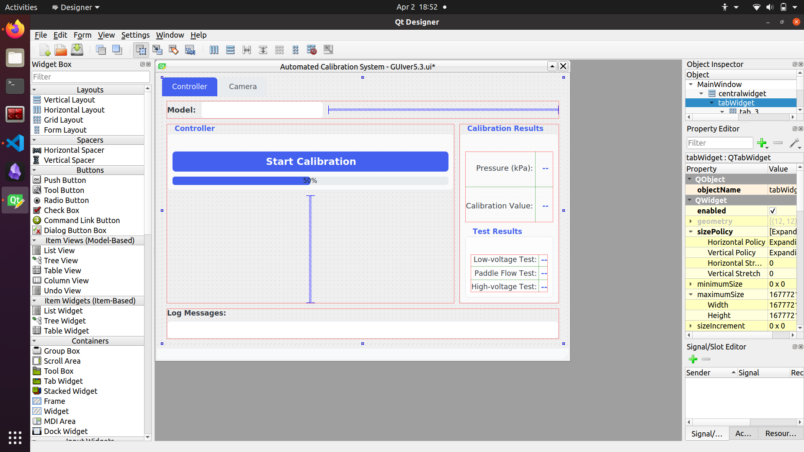

# Automated Calibration System For Pump Controller Documentation

## Overview

The Automated Calibration System is a PyQt5-based application designed to automate the calibration and testing process for various device models. The system integrates webcam capture, optical character recognition (OCR), LED detection, and Arduino-based control to create a streamlined testing workflow.

3D design of the system over view


Full model link in Fusion360: [Fusion model](https://url.au.m.mimecastprotect.com/s/ZeevC2xMo3spy90EnInfnc5tLDb?domain=a360.co)

User interface overview


## System Architecture

### Main Components

1. **GUI Interface**: Built with PyQt5 using multi-threaded. Designed with QtDesigner.
2. **Arduino Communication**: UART protocol interface for controlling hardware operations
3. **Computer Vision System**:
   - OCR for extracting readings from device displays
   - LED detection for verifying indicator states
4. **Test Workflow**: Automated sequence of operations for testing different models

### File Structure

- `GUIver5.3.py`: Main application code
- `GUIver5.3.ui`: Qt UI definition file
- Additional supporting modules:
  - `ocr.py`: OCR processor for text recognition
  - `utils.py`: Contains SerialCommunicator for Arduino communication
  - `led_detector.py`: Computer vision module for LED state detection
  - `webcam_thread.py`: Threaded webcam capture implementation
  - `port_selection.py`: Dialog for selecting connection parameters
  - `config.py`: Configuration settings

## User Interface



The UI is divided into two main tabs:

### Controller Tab

Contains the main testing interface with:

- **Model Selection**: Dropdown to select the device model (F60, E30, IPG20, F29)
- **Controller Panel**: Features a Start/Stop button and progress bar
- **Results Panel**: Displays calibration readings and test results:
  - Pressure (kPa)
  - Calibration Value
  - Test results for:
    - Low-voltage Test
    - Paddle Flow Test
    - High-voltage Test
- **Log Messages**: Shows the most recent system operation message

### Camera Tab

Provides a direct view of the webcam feed with:
- Live camera display
- Camera control buttons (View Feed, Take Snapshot, Close Feed)

## Workflow

The application implements an automated testing workflow that varies by device model:

1. **Initialization**:
   - User selects device model
   - System establishes connections to webcam and Arduino
   - OCR system is initialized

2. **Test Sequence Start**:
   - User clicks "GO" button
   - Safety checklist dialog appears requiring confirmation
   - System begins testing sequence by sending `PUMP_SEQ` command to Arduino

3. **Lock Status Detection**:
   - System captures image of device screen
   - OCR identifies "LOCKED" or "UNLOCKED" status
   - Arduino performs appropriate sequence based on lock status

4. **Calibration Testing**:
   - System captures and processes kPa and Calibration values
   - Low-voltage test results are determined based on readings
   - For certain models (F60, IPG20), flow test sequence continues

5. **Paddle Flow Test** (Model-specific):
   - For F60 and IPG20 models, paddle flow testing is performed
   - System monitors LED states using computer vision
   - Verifies LED blinking and placement

6. **Results and Completion**:
   - All test results are displayed in the interface
   - System returns to ready state for next test

## Model-Specific Behaviors

The system behavior varies by model selection:

- **F60**: Complete sequence including LED verification with specific blinking test
- **IPG20**: Complete sequence with paddle flow test and LED verification
- **E30**: Low-voltage test with additional high-voltage test
- **F29**: Basic calibration test

## Emergency Stop System

The application includes a high-priority emergency stop mechanism:

- Emergency stop is triggered when the "STOP" button is pressed
- All ongoing operations are immediately halted
- Arduino is sent a `STOP` command
- All timers are stopped and serial buffers are cleared
- UI is reset to initial state

## Hardware Communication

### Arduino Interface

- Serial communication at configurable baud rate
- Command-based protocol for controlling test apparatus
- Bidirectional communication for status updates
- Key commands include:
  - `PUMP_SEQ`: Start the pump sequence
  - `LOCKED_SEQUENCE`/`UNLOCKED_SEQUENCE`: Lock-state specific operations
  - `PRESS_P`: Press the programming button
  - `STOP`: Emergency stop all operations
  - `PUSH_PADDLE`: Activate paddle mechanism
  - `START_BLINKING_TEST_F60`: Initiate F60 LED blinking test

### Webcam Integration

- Implemented with a dedicated thread for non-blocking operation
- Provides frames for both display and image processing
- Defined regions of interest for OCR and LED detection

## Computer Vision Features

### OCR Processing

- Extracts numeric values from device display
- Captures kPa and Calibration values
- Detects lock status from display text

### LED Detection

The system includes sophisticated LED detection capabilities:

- Predefined box coordinates for LED regions of interest: 
  ```python
  self.led_box_coordinates = [
      [56, 269, 37, 37], 
      [60, 329, 36, 33],
      [65, 383, 40, 34]
  ]
  ```
- Color-based detection for green LED indicators
- Brightness threshold analysis for "on" state detection
- Blinking detection through temporal analysis

## Data Management

- Captured images are stored with timestamps
- Image path structure:
  ```
  /SnapShotImages/
    ├── processed_snapshot_simple{timestamp}.jpg
    ├── LOCK2UNLOCK{timestamp}.jpg
    ├── led_verification_{timestamp}.jpg
    └── led_detection_{timestamp}.jpg
  ```
- OCR results and test outcomes are displayed in real-time

## Setup and Configuration

### Connection Setup

- On startup, a port selection dialog allows users to configure:
  - Webcam index
  - Arduino serial port
  - Baud rate

### Safety Features

Before starting a test, users must confirm a safety checklist:
1. Power jack is plugged into electric box
2. USB cable is connected to laptop
3. Air pressure is opened

## Exception Handling

The application includes comprehensive error handling:

- Communication errors with Arduino
- Webcam connection failures
- OCR processing errors
- Test sequence failures

Each error case includes appropriate user feedback and safe shutdown procedures.

## Technical Implementation Notes

### Threading Model

- Main UI operations run on the primary thread
- Webcam capture runs on a dedicated thread
- Arduino communication is managed through timer-based polling
- Signal-slot mechanism used for thread-safe UI updates

### Output Redirection

Custom stdout redirection for logging:
```python
class OutputStreamRedirector(object):
    def __init__(self, text_widget):
        self.text_widget = text_widget
        self.last_message = ""
        
    def write(self, text):
        # Store the original stdout for debugging
        sys.__stdout__.write(text)
        
        # Only update the widget if it's not empty (ignoring newlines)
        if text.strip():
            self.last_message = text.strip()
            # Use the Qt signal-slot mechanism to update the UI from any thread
            QtCore.QMetaObject.invokeMethod(
                self.text_widget, 
                "setText", 
                Qt.QueuedConnection,
                QtCore.Q_ARG(str, self.last_message)
            )
```

### User Interface Design

The UI features a modern design with:
- Clean, responsive layout
- Color-coded elements
- Progressive disclosure of information
- Comprehensive feedback mechanisms
- Consistent styling across components

## Future Enhancements

Potential areas for future development:

1. Database integration for test result storage
2. Report generation capabilities
3. Additional model support
4. Enhanced error recovery mechanisms
5. Remote monitoring capabilities

## Troubleshooting

Common issues and solutions:

1. **Arduino Connection Failures**:
   - Verify port settings in the port selection dialog
   - Check physical connections and power supply
   - Confirm proper driver installation

2. **OCR Recognition Issues**:
   - Adjust lighting conditions
   - Ensure camera is properly focused
   - Check for obstructions or glare on device display

3. **LED Detection Problems**:
   - Verify box coordinates match physical LED positions
   - Adjust brightness thresholds if needed
   - Check for ambient light interference

4. **Test Sequence Failures**:
   - Examine log messages for specific error points
   - Verify device is properly powered and in correct initial state
   - Ensure air pressure system is functioning correctly
